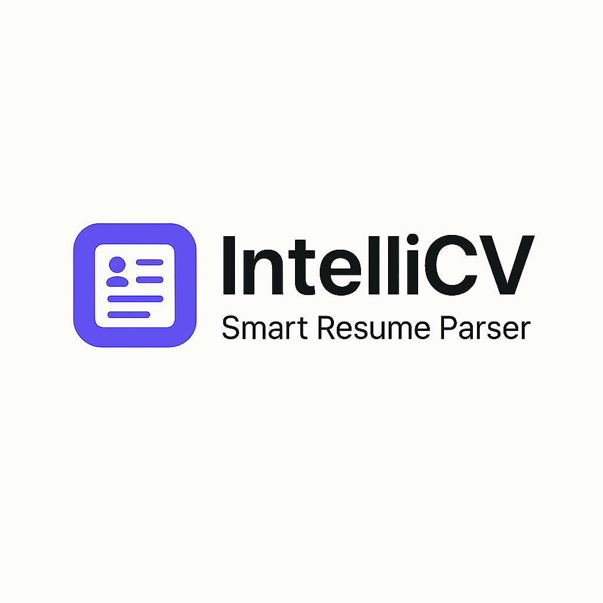
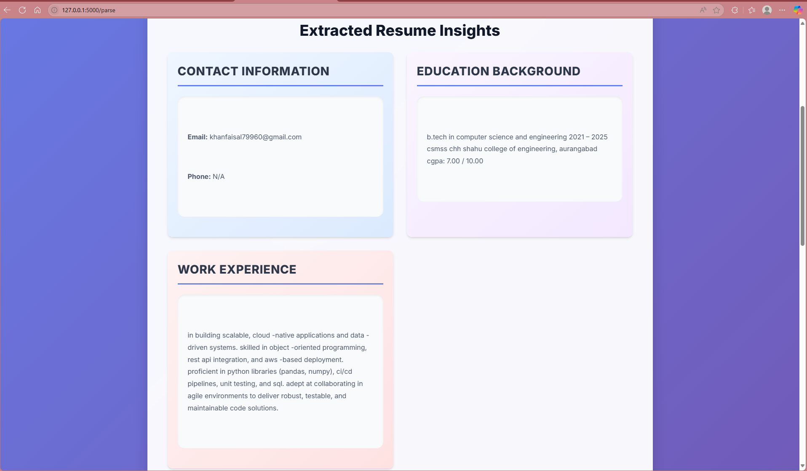
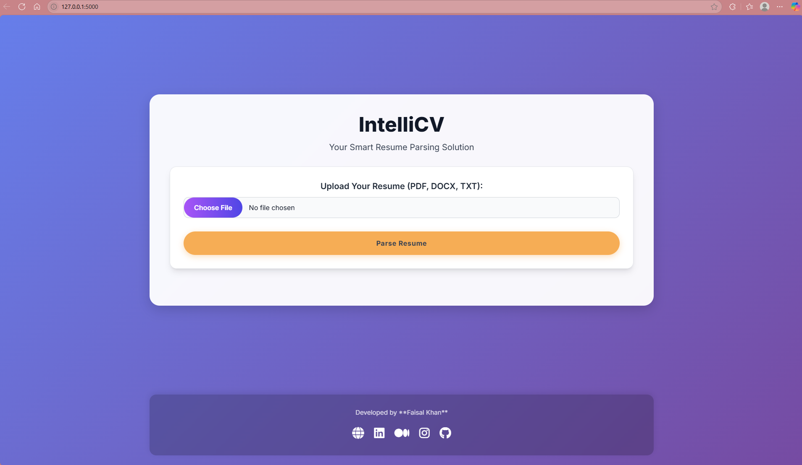

# 📄 IntelliCV — AI-Powered Resume Parser with Flask & NLTK



**IntelliCV** is an intelligent resume parsing tool built with **Flask**, **Python**, and **NLTK**. It allows users to upload resumes (PDF/DOCX) and extracts structured information such as contact details, skills, education, and experience. The application features a modern, responsive design with vibrant visuals and a full parsed text view for transparency.

---

## 🚀 Live Demo

👉 [**View Live Demo**](https://intelli-cv-smoky.vercel.app/)

---

## 🌟 Features

- 📤 **Resume Upload**: Upload resumes in PDF or DOCX format.
- 📊 **Data Extraction**: Automatically detects name, email, phone, skills, and more.
- 🤖 **NLP-Powered Parsing**: Uses NLTK to process and extract key information.
- 🧾 **Full Text View**: Shows the complete parsed text for reference.
- 🎨 **Modern UI**: Clean, full-screen responsive interface with Bootstrap styling.
- 🔗 **Multiple Language Support**: Supports 33 languages for parsing.

---

## 🛠️ Tech Stack

**Backend**:
- Python
- Flask
- NLTK
- PyPDF2
- python-docx

**Frontend**:
- HTML5, CSS3, Bootstrap 5
- Responsive Design
- Icons (Font Awesome)

**Dev Tools**:
- Jupyter Notebook (NLP Preprocessing)
- Joblib (for serialization)
- Git & GitHub

---

## 📁 Project Structure

```
IntelliCV/
├── app.py
├── README.md
├── requirements.txt
├── templates/
│   ├── index.html
│   ├── 404.html
├── static/
│   └── style.css
├── parser/
│   └── __init__.py
│   └── resume_parser.py
└── assets/
    ├── cover_image.png
    ├── screenshot_1.png
    └── screenshot_2.png
```

---

## 🚀 Getting Started

```bash
git clone https://github.com/khanfaisal79960/IntelliCV.git
cd IntelliCV
python -m venv venv
source venv/bin/activate  # On Windows: .\venv\Scripts\activate
pip install -r requirements.txt
python app.py
```

Open your browser at: [http://127.0.0.1:5000](http://127.0.0.1:5000)

---

| Home Page | Parsed Results |
|-----------|----------------|
|  |  |

---

## 💡 Usage Guide

- Go to the homepage and upload a resume.
- The app will display extracted data (name, email, skills, etc.).
- At the bottom, you'll see the full parsed resume text.

---

## 🤝 Contributing

If you'd like to contribute or improve the project, feel free to fork the repo, submit issues, or open pull requests.

---

## 🙋‍♂️ Author

**Faisal Khan**  
- 🌐 [Portfolio](https://khanfaisal.netlify.app)  
- 💼 [LinkedIn](https://www.linkedin.com/in/khanfaisal79960)  
- ✍️ [Medium](https://medium.com/@khanfaisal79960)  
- 📸 [Instagram](https://instagram.com/mr._perfect_1004)  
- 💻 [GitHub](https://github.com/khanfaisal79960)  
